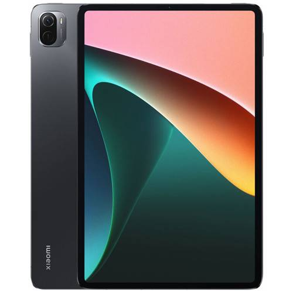

# Xiaomi-Mi-Pad5-Linux-Install
Эта инструкция предоставляет подробные шаги по установке различных версий Linux, включая Arch Linux и Ubuntu, на устройство Mi Pad 5. В документе описаны версии системы, особенности установки и рекомендации по выбору наиболее подходящего дистрибутива для оптимальной производительности и удобства использования.



## Установка Linux систем для Xiaomi Mi Pad 5 (nabu):


### Доступные дистрибутивы в данном мануале:

1. **Ubuntu V0.9:**
    - 22.04
    - 23.04
    - 23.10

2. **Ubuntu V0.91:**
    - 23.10 * (Я советую ставить именно эту версию Ubuntu, так как здесь из коробки работает звук)*

3. **Arch Linux**

Инструкция подходит для Linux и Windows, macOS пользователей.

## Инструкция:

<details>
  <summary>📢 Внимание! Перед началом раскройте и прочитайте этот спойлер! 📢</summary>

**Я не несу ответственности за ваше устройство, данный мануал Вы используете чисто на свой страх и риск, поэтому подумайте 100 раз прежде чем что-то делать.**

*Если уйти от мануала хотя бы на 1 цифру/букву/ и т.д. - можете получить кирпич.*

</details>

<details>
<summary>💾 Что Вам потребуется (Загрузка файлов) </summary>

1. [Исходники &#91;MEGA&#93;](https://mega.nz/folder/CVMGEAiB#7oazR3wpkKdAH2eZChtRTg)
   Отсюда выбираем:

- систему, которую хотим, я для примера выберу (и Вам еще раз советую): Ubuntu-V0.91 23.10 и скачаю:
    1. vbmeta_disabled.img

  *Далее перейду в папку Ubuntu-V0.91*
    2. boot-loader-tar.xz
    3. rootfs.img.xz


- Кладем это все на диск в быстродоступное место (я положил */Documents/mipad*)

3. Далее потребуется platform-tools:

    - [Качаем с официального сайта под свою систему](https://developer.android.com/tools/releases/platform-tools)
    - Кладем в ту же самую папку.

4. Еще нам нужно скачать:

    - [Xiaomi Nabu Orangefox Image](https://drive.google.com/file/d/1gCNtoDMNCAmMR61xegvCC3mxv28gMJbi/view)

    - Кладем в ту же самую папку.

5. На этом загрузка завершена, переходим к действиям.
</details>

<details>
 <summary>⚒ Действия по прошивке</summary>

1. Берем свой планшет, подключаем к PC по USB, далее зажимаем кнопки "Выключить" и "Громкость -", и ждём. На экране Вашего устройства появится надпись "Fastboot".
2. Открываем терминал на компьютере (*в Linux и macOS просто запускаем Terminal, а в Windows нажимаем сочетание клавиш Win + R, пишем cmd и Enter*)
3. Переходим в директорию, в которую мы все загружали внутри терминала с помощью команды:

   ```cd /Documents/mipad/platform-tools```

4. Используем:

   ```fastboot devices```

   , видим что в ответ нам написали:

   ```e36212f4  fastboot```

   Следовательно, компьютер видит наш планшет. (*буквы и цифры могут отличаться*)

5. Далее нам нужно отправить на планшет OrangeFox Image, для этого используем:

   ```fastboot boot xiaomi-nabu-orangefox.img```

   После этого наш планшет перезагрузится, Вы увидите темно-синий экран и оранжевую полоску наверху, далее появится время и какие-то символы.

   Не пугайтесь, это именно то что нам нужно!

6. Выполняем команду:

   ```adb devices```

   и ожидаем в ответ увидеть:

   ```
   List of devices attached 
   e36212f4        recovery  
   ```

   Главное - не пусто, циферы и буквы могут отличаться.

7. Следующий шаг:

   ```adb shell```

   получаем подконсоль, которая приветствует нас:

   ```sh-5.0#```


8. Используем команду по размещению userdata:

   ```ls -l /dev/block/bootdevice/by-name/ | grep userdata```

   в ответе будет:

   ```lrwxrwxrwx 1 root root 16 1971-06-22 05:04 userdata -> /dev/block/sda31```


9. Дальше нам нужно разбить диск на несколько разделов, поэтому мы будем использовать:
      ```
      parted /dev/block/sda
      ```
   ответ подконсоли:
   ```
   GNU Parted 3.3
   Using /dev/block/sda
   Welcome to GNU Parted! Type 'help' to view a list of commands.
   (parted)
   ```

10. Вводим команду

```print```

а в ответ получаем список разделов:
```print
Model: SAMSUNG KLUDG4UHDC-B0E1 (scsi)
Disk /dev/block/sda: 126GB
Sector size (logical/physical): 4096B/4096B
Partition Table: gpt
Disk Flags:
Number  Start   End     Size    File system  Name             Flags
1      24.6kB  32.8kB  8192B                switch
2      32.8kB  65.5kB  32.8kB               ssd
3      65.5kB  98.3kB  32.8kB               dbg
4      98.3kB  131kB   32.8kB               bk01
5      131kB   262kB   131kB                bk02
6      262kB   524kB   262kB                bk03
7      524kB   1049kB  524kB                bk04
8      1049kB  1573kB  524kB                keystore
9      1573kB  2097kB  524kB                frp
10      2097kB  4194kB  2097kB               countrycode
11      4194kB  8389kB  4194kB               misc
12      8389kB  12.6MB  4194kB               vm-data
13      12.6MB  16.8MB  4194kB               bk06
14      16.8MB  25.2MB  8389kB               logfs
15      25.2MB  33.6MB  8389kB               ffu
16      33.6MB  50.3MB  16.8MB               oops
17      50.3MB  67.1MB  16.8MB               devinfo
18      67.1MB  83.9MB  16.8MB               oem_misc1
19      83.9MB  101MB   16.8MB  ext4         metadata
20      101MB   134MB   32.9MB               bk08
21      134MB   168MB   34.2MB               splash
22      168MB   201MB   33.6MB               bk09
23      201MB   9328MB  9127MB               super
24      9328MB  9328MB  131kB                vbmeta_system_a
25      9328MB  9328MB  131kB                vbmeta_system_b
26      9328MB  9396MB  67.1MB               logdump
27      9396MB  9530MB  134MB                minidump
28      9530MB  9664MB  134MB                rawdump
29      9664MB  10.7GB  1074MB  ext4         cust
30      10.7GB  10.9GB  134MB   ext4         rescue
31      10.9GB  126GB   115GB                userdata
```
Из этого всего нас интересует раздел userdata, который самый последний под номером 31.
11. Удаляем раздел номер 31:

```rm 31```

в ответе:

```rm 31```

12. Снова хотим посмотреть что получилось и вводим:

```print```

В ответе ожидаем что-то такое:

```
print
Model: SAMSUNG KLUDG4UHDC-B0E1 (scsi)
Disk /dev/block/sda: 126GB
Sector size (logical/physical): 4096B/4096B
Partition Table: gpt
Disk Flags:
Number  Start   End     Size    File system  Name             Flags
1      24.6kB  32.8kB  8192B                switch
2      32.8kB  65.5kB  32.8kB               ssd
3      65.5kB  98.3kB  32.8kB               dbg
4      98.3kB  131kB   32.8kB               bk01
5      131kB   262kB   131kB                bk02
6      262kB   524kB   262kB                bk03
7      524kB   1049kB  524kB                bk04
8      1049kB  1573kB  524kB                keystore
9      1573kB  2097kB  524kB                frp
10      2097kB  4194kB  2097kB               countrycode
11      4194kB  8389kB  4194kB               misc
12      8389kB  12.6MB  4194kB               vm-data
13      12.6MB  16.8MB  4194kB               bk06
14      16.8MB  25.2MB  8389kB               logfs
15      25.2MB  33.6MB  8389kB               ffu
16      33.6MB  50.3MB  16.8MB               oops
17      50.3MB  67.1MB  16.8MB               devinfo
18      67.1MB  83.9MB  16.8MB               oem_misc1
19      83.9MB  101MB   16.8MB  ext4         metadata
20      101MB   134MB   32.9MB               bk08
21      134MB   168MB   34.2MB               splash
22      168MB   201MB   33.6MB               bk09
23      201MB   9328MB  9127MB               super
24      9328MB  9328MB  131kB                vbmeta_system_a
25      9328MB  9328MB  131kB                vbmeta_system_b
26      9328MB  9396MB  67.1MB               logdump
27      9396MB  9530MB  134MB                minidump
28      9530MB  9664MB  134MB                rawdump
29      9664MB  10.7GB  1074MB  ext4         cust
30      10.7GB  10.9GB  134MB   ext4         rescue
```

**ВНИМАНИЕ! WARNING!**

Обратите внимание на конец последнего раздела в приведенном выше списке, 10,9 ГБ. Это число будет использоваться в качестве начала нового раздела пользовательских данных, за которым последует конец раздела. Допустим, мы хотим создать раздел пользовательских данных размером около 40 ГБ, используя следующую команду.

**ПРИМЕЧАНИЕ.** Между пользовательскими данными и 10,9 ГБ находятся 3 пробела, один из них заменяет флаг типа раздела, на этом этапе **важно использовать 3 пробела.**

13. ПРОЧИТАВ ПРЕДУПРЕЖДЕНИЕ ВЫШЕ, мы используем команду С ВНИМАНИЕМ НА КАЖДЫЙ ПРОБЕЛ:

    ```mkpart userdata   10.9GB 50GB```

    в ответ ожидаем:

    ```mkpart userdata   10.9GB 50GB```

14. Давайте вновь посмотрим разделы и введем:

    ```print```

    В ответе ожидаем:

    ```
    print
    Model: SAMSUNG KLUDG4UHDC-B0E1 (scsi)
    Disk /dev/block/sda: 126GB
    Sector size (logical/physical): 4096B/4096B
    Partition Table: gpt
    Disk Flags:
    Number  Start   End     Size    File system  Name             Flags
    1      24.6kB  32.8kB  8192B                switch
    2      32.8kB  65.5kB  32.8kB               ssd
    3      65.5kB  98.3kB  32.8kB               dbg
    4      98.3kB  131kB   32.8kB               bk01
    5      131kB   262kB   131kB                bk02
    6      262kB   524kB   262kB                bk03
    7      524kB   1049kB  524kB                bk04
    8      1049kB  1573kB  524kB                keystore
    9      1573kB  2097kB  524kB                frp
    10      2097kB  4194kB  2097kB               countrycode
    11      4194kB  8389kB  4194kB               misc
    12      8389kB  12.6MB  4194kB               vm-data
    13      12.6MB  16.8MB  4194kB               bk06
    14      16.8MB  25.2MB  8389kB               logfs
    15      25.2MB  33.6MB  8389kB               ffu
    16      33.6MB  50.3MB  16.8MB               oops
    17      50.3MB  67.1MB  16.8MB               devinfo
    18      67.1MB  83.9MB  16.8MB               oem_misc1
    19      83.9MB  101MB   16.8MB  ext4         metadata
    20      101MB   134MB   32.9MB               bk08
    21      134MB   168MB   34.2MB               splash
    22      168MB   201MB   33.6MB               bk09
    23      201MB   9328MB  9127MB               super
    24      9328MB  9328MB  131kB                vbmeta_system_a
    25      9328MB  9328MB  131kB                vbmeta_system_b
    26      9328MB  9396MB  67.1MB               logdump
    27      9396MB  9530MB  134MB                minidump
    28      9530MB  9664MB  134MB                rawdump
    29      9664MB  10.7GB  1074MB  ext4         cust
    30      10.7GB  10.9GB  134MB   ext4         rescue
    31      10.9GB  50.0GB  39.1GB               userdata
    ```

15. Теперь мы можем выйти из parted:

    ```quit```

    Ответ:

    ```
    quit
    Information: You may need to update /etc/fstab.[/code]
    ```

    и снова попадаем в подконсоль:

    ```sh-5.0#```

16. Перезагрузитесь в Android, вводим:

    ```reboot```

    Дайте ОС выполнить работу по исправлению и форматированию пользовательских данных в новом размере. Первая загрузка после изменения размера займет некоторое время, поэтому возьмите кофе, [hide]пиво[/hide] или что-нибудь еще. Обратите внимание: важно сохранить исходное имя раздела «userdata».

17. После успешной загрузки устройства, снова отправляем его в Fastboot, для этого зажмите "Выключение" и "Громкость -" до появления заветной надписи "FASTBOOT".

19. Ипользуем 4 команды по очереди (ранее мы их уже использовали, поэтому ожидаемые ответы можете посмотреть выше):
    ```
    fastboot boot xiaomi-nabu-orangefox.img
    adb devices
    adb shell
    parted /dev/block/sda
    ```
20. Используйте последний конец в качестве начала нового раздела, а в качестве конца — желаемый дополнительный размер вашего раздела, представим, что нам нужен раздел PMO размером 20 ГБ в качестве ext4 (минимальный размер раздела — 4 ГБ), для этого просто выполните команду:

    ```mkpart pmos ext4 50.0GB 70GB```

21. После этой команды, Вы можете посмотреть сколько свободного места осталось на Вашем жестком диске, для этого введите:

    ```print free```

    ожидаем увидеть:

    ```
    print free
    Model: SAMSUNG KLUDG4UHDC-B0E1 (scsi)
    Disk /dev/block/sda: 126GB
    Sector size (logical/physical): 4096B/4096B
    Partition Table: gpt
    Disk Flags:
    Number  Start   End     Size    File system  Name             Flags
    12.3kB  24.6kB  12.3kB  Free Space
    1      24.6kB  32.8kB  8192B                switch
    2      32.8kB  65.5kB  32.8kB               ssd
    3      65.5kB  98.3kB  32.8kB               dbg
    4      98.3kB  131kB   32.8kB               bk01
    5      131kB   262kB   131kB                bk02
    6      262kB   524kB   262kB                bk03
    7      524kB   1049kB  524kB                bk04
    8      1049kB  1573kB  524kB                keystore
    9      1573kB  2097kB  524kB                frp
    10      2097kB  4194kB  2097kB               countrycode
    11      4194kB  8389kB  4194kB               misc
    12      8389kB  12.6MB  4194kB               vm-data
    13      12.6MB  16.8MB  4194kB               bk06
    14      16.8MB  25.2MB  8389kB               logfs
    15      25.2MB  33.6MB  8389kB               ffu
    16      33.6MB  50.3MB  16.8MB               oops
    17      50.3MB  67.1MB  16.8MB               devinfo
    18      67.1MB  83.9MB  16.8MB               oem_misc1
    19      83.9MB  101MB   16.8MB  ext4         metadata
    20      101MB   134MB   32.9MB               bk08
    21      134MB   168MB   34.2MB               splash
    22      168MB   201MB   33.6MB               bk09
    23      201MB   9328MB  9127MB               super
    24      9328MB  9328MB  131kB                vbmeta_system_a
    25      9328MB  9328MB  131kB                vbmeta_system_b
    26      9328MB  9396MB  67.1MB               logdump
    27      9396MB  9530MB  134MB                minidump
    28      9530MB  9664MB  134MB                rawdump
    29      9664MB  10.7GB  1074MB  ext4         cust
    30      10.7GB  10.9GB  134MB   ext4         rescue
    10.9GB  10.9GB  786kB   Free Space
    31      10.9GB  50.0GB  39.1GB               userdata
    32      50.0GB  70.0GB  20.0GB  ext4         pmos
    70.0GB  126GB   55.6GB  Free Space
    ```
    Последнее значение это сколько у Вас осталось свободного всего.

    **ЗАПОМИНАЕМ цифру в левом столбце, у меня это 32!**

21. Замечательно! Теперь выходим с помощью команды:

    ```quit```

22. Делаем полную перезагрузку:

    ```reboot```

23. После того как система загрузилась, снова заходим в FASTBOOT ("Выключить" и "Громкость -").
24. А вот сейчас **внимательный момент**, мы вводим:

    ```fastboot getvar current-slot```

    а в ответ ожидаем:

    ```
    current-slot: b
    Finished. Total time: 0.004s
    ```
    **ВНИМАНИЕ! У Вас может быть ДРУГОЙ СЛОТ! Скорее всего будет 'a'.**

    Следовательно, если у Вас тут 'b' - значит Android использует слот 'b', если у Вас слот 'a' - значит Android использует слот 'a'.

    Для Linux нам потребуется другой слот, поэтому если у Вас current-slot: b мы используем команду:

    ```fastboot set_active a```

    и ожидаем ответ:

    ```
    Setting current slot to 'a'                        OKAY &#91;  0.049s&#93;
    Finished. Total time: 0.064s
    ```

    А ЕСЛИ У ВАС БЫЛ СЛОТ 'a', то мы используем:

    ```fastboot set_active b```

    и ожидаем ответ с литералом 'b'.

    **НАМ НУЖНО ЗАПОМНИТЬ ГДЕ У НАС Android, а где UBUNTU. Запишите на листочке рядом и положите до конца установки!
    Далее я буду писать <СЛОТ>, а Вы туда вставляете тот, на который переключились, [u]просто букву, без <>[/u].**
25. Запись изображений начинаем с команды **(Внимание! Слот!)**:

    ```fastboot flash vbmeta_<СЛОТ> vbmeta_disabled.img```

    Ответ (*если у Вас ubuntu ставится на слот 'a'*):

    ```
    Sending 'vbmeta_a' (4 KB)                          OKAY &#91;  0.007s&#93;
    Writing 'vbmeta_a'                                 OKAY &#91;  0.003s&#93;
    Finished. Total time: 0.048s
    ```
26. Затираем dtbo **(Внимание! Слот!)**:

    ```fastboot erase dtbo_<СЛОТ>```

    Ответ:
    ```
    Erasing 'dtbo_a'                                   OKAY &#91;  0.007s&#93;
    Finished. Total time: 0.022s
    ```
27. Закидываем boot, а именно, если у нас на шаге номер 20, последняя циферка в правом столбике 32, которую мы запоминали, то тогда мы используем **(ВНИМАНИЕ! Слот!)**:

    ```platform-tools>fastboot flash boot_<СЛОТ> /boot-loader/boot_xiaomi-nabu_sda32.img```

    а если другая цифра была, то файлик с той цифрой, которая у Вас последняя была в 20-ом пункте нашего мануала.

    Ответ ожидаем:

    ```
    Sending 'boot_a' (13052 KB)                        OKAY &#91;  0.327s&#93;
    Writing 'boot_a'                                   OKAY &#91;  0.052s&#93;
    Finished. Total time: 0.663s
    ```
28. Финишная прямая!

    Заливаем сам образ прошивки! (Если скачивали архив, то распакуйте его, там будет лежать img файл):

    ```fastboot flash pmos ubuntu.img```

29. Перезагрузка в Linux:

    ```fastboot reboot```
</details>


<details>
<summary>📲 Переключение Android/Linux</summary>

Как происходит переключение между Android и Linux? В скором времени выложу скрипты для Linux и APK файл для Android, но пока что:
1. Введите свой планшет в режим Fastboot ("Выключение" и "Громкость -").
2. Подключите его через USB к компьютеру.
3. Откройте консоль и перейдите в свою папку с platform-tools (мы клали ее в /Documents/mipad)
4. Введите команду:

   ```fastboot getvar current-slot```

   и если в ответ получите:

   ```
   current-slot: a
   Finished. Total time: 0.004s
   ```

   И у Вас загружается всегда система Linux сейчас, то значит чтобы, переключиться на Android Вам нужно ввести команду:

   ```fastboot set_active b```

   а если у Вас выдало 'current-slot: b', то введите:

   ```fastboot set_active a```
5. Далее команда:

   ```flashboot reboot```

   перезагрузит Вас в другую ОС.

6. ВНИМАНИЕ!

   При первом включении после прошивок Android, Вы скорее всего попадете в Recovery Menu. Там выберите Wipe Data (передвигаться с помощью "Громкость -" и "Громкость +"), далее подтвердите удаление, потом выберите "Reboot". Вы загрузитесь в Android.

</details>

&nbsp;

<details>
<summary>Благодарности</summary>

*Основа инструкции взята с форума [XDA](https://xdaforums.com/t/rom-ubuntu-on-xiaomi-pad-5-nabu.4597149/).*

Отдельная благодарность:
- maverick_jia
- z64uDAvMCd (Timofei)
- map220v
- serdeliuk
</details>